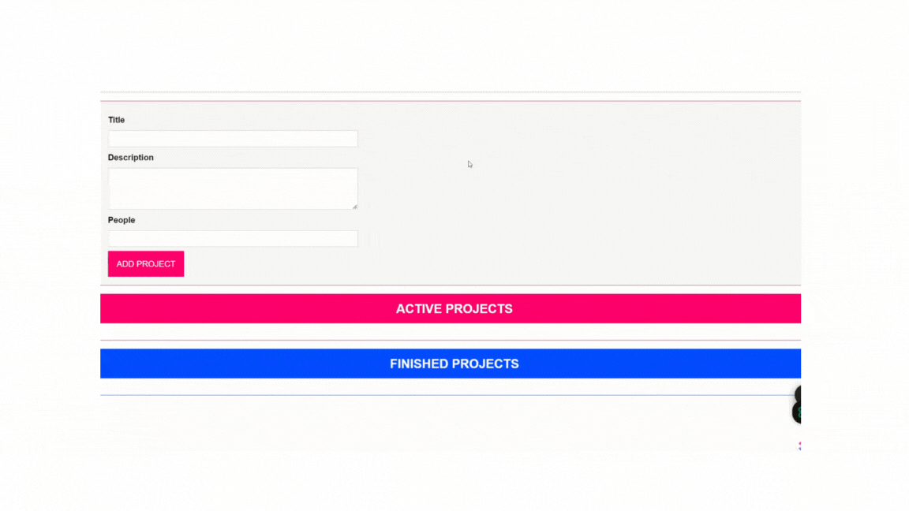

# Drag and Drop Project

## Overview

This project demonstrates a drag-and-drop application where users can manage projects. The application allows users to add projects with a title, description, and number of people, and then drag and drop these projects between different lists (e.g., active and finished).

The project is structured using TypeScript and ES modules, with a focus on clean code organization through the use of namespaces, classes, and decorators.

## Project Structure

- **Components**: Contains UI components and logic for rendering and interacting with the DOM.
- **Models**: Defines data structures and types used throughout the application.
- **State**: Manages the global state and handles project updates.
- **Util**: Provides utility functions, such as validation.
- **Decorators**: Contains decorators used for binding methods.

## Features

- **Project Input**: Allows users to input project details (title, description, number of people).
- **Project List**: Displays a list of projects with drag-and-drop functionality.
- **Project Item**: Represents individual projects within the list.

## Modules and Namespaces

### Models

- **ProjectStatus**: Enum defining the possible statuses of a project (Active, Finished).
- **Project**: Class representing a project, including its id, title, description, number of people, and status.

### State Management

- **State**: A generic class that manages listeners for state changes.
- **ProjectState**: Singleton class extending `State` to manage projects. Includes methods for adding and moving projects and notifying listeners of changes.

### Components

- **Component**: Abstract base class for creating components with a template. Provides methods for configuring and rendering content.
- **ProjectInput**: Component for inputting new projects. Validates input and handles form submission.
- **ProjectList**: Component that displays a list of projects. Supports drag-and-drop functionality.
- **ProjectItem**: Represents a single project item. Supports drag-and-drop functionality.

### Utilities

- **Validatable**: Interface defining the shape of validation objects.
- **validate**: Function for validating input based on the `Validatable` interface.

### Decorators

- **autobind**: Decorator for automatically binding class methods to their instance.

## Installation

To get started with the project, follow these steps:

1. **Clone the Repository**

   ```bash
   git clone <repository-url>
   cd <repository-directory>
   ```

2. **Install Dependencies**

   Ensure you have Node.js installed, then run:

   ```bash
   npm install
   ```

3. **Build the Project**

   Compile TypeScript code to JavaScript:

   ```bash
   npm run build
   ```

4. **Start the Application**

   Open the `index.html` file in a browser or use a local server to view the application.

## Usage

1. **Add a Project**

   - Enter a title, description, and number of people in the input form.
   - Click the "Add Project" button to create a new project.

2. **Drag and Drop Projects**

   - Drag projects from one list (e.g., Active) to another (e.g., Finished) to update their status.

## Code Explanation

### Namespaces and ES Modules

The project uses namespaces for organizing code into logical groups. This helps manage and encapsulate related functionality. Additionally, ES modules are used for importing and exporting classes, interfaces, and functions across different files, promoting modularity and reuse.

### Example Code

Here’s a quick example of how the components are structured:

- **ProjectInput**: Handles form submission and validation, and adds projects to the state.
- **ProjectList**: Displays projects and handles drag-and-drop events.
- **ProjectItem**: Represents individual projects and supports drag-and-drop functionality.

## Contributing

Feel free to contribute to the project by submitting issues or pull requests. Make sure to follow the code style and include tests where applicable.

## License

This project is licensed under the [MIT License](LICENSE).

---

This README provides an overview of the project's structure, features, and usage instructions, along with details about the modules, namespaces, and ES module integration.

### Here is an expected gif of the final project


